# 智能工具人机交互与远程操控系统 - 功能架构流程图

## 📋 项目概览

**项目名称**：智能工具人机交互与远程操控系统 (Smart Control System)
**项目版本**：V1.0
**开发语言**：Go 1.20+
**目标代码量**：约 20,000 行
**核心模块**：10大功能模块

---

## 🏗️ 系统整体架构

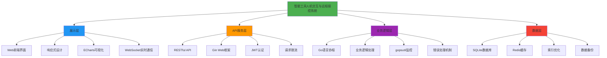

---

## 🎯 十大核心功能模块

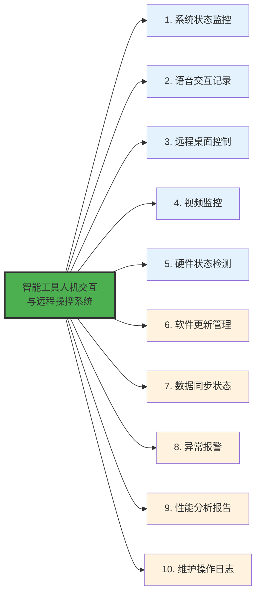

---

## 🔍 模块详细功能流程

### 1️⃣ 系统状态监控模块

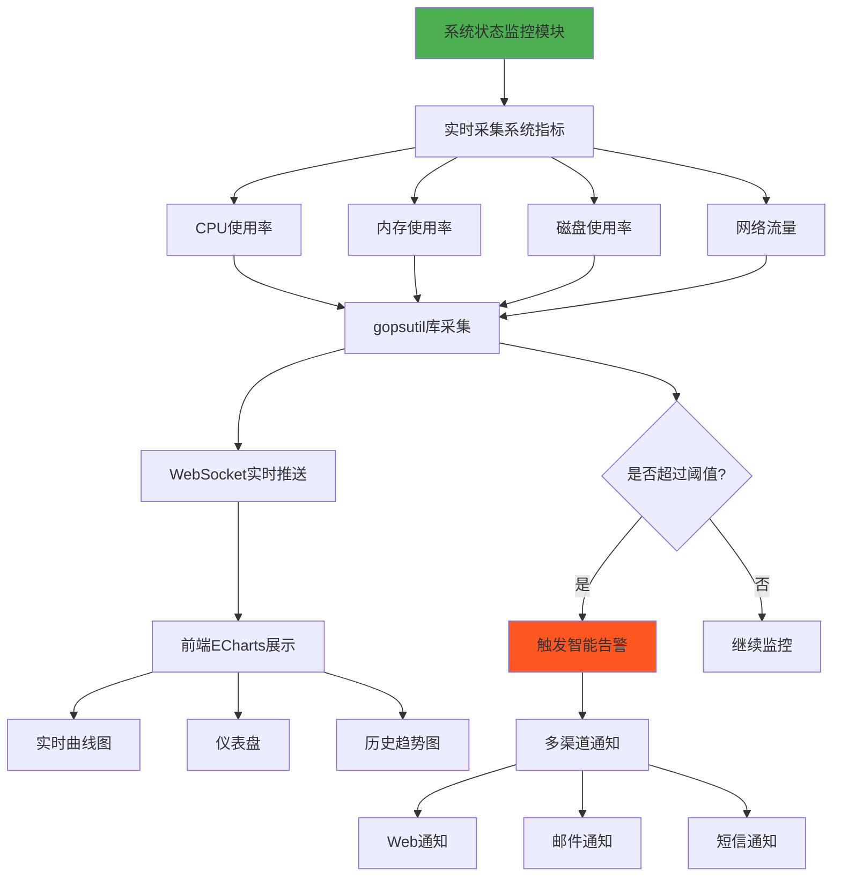

### 2️⃣ 语音交互记录模块

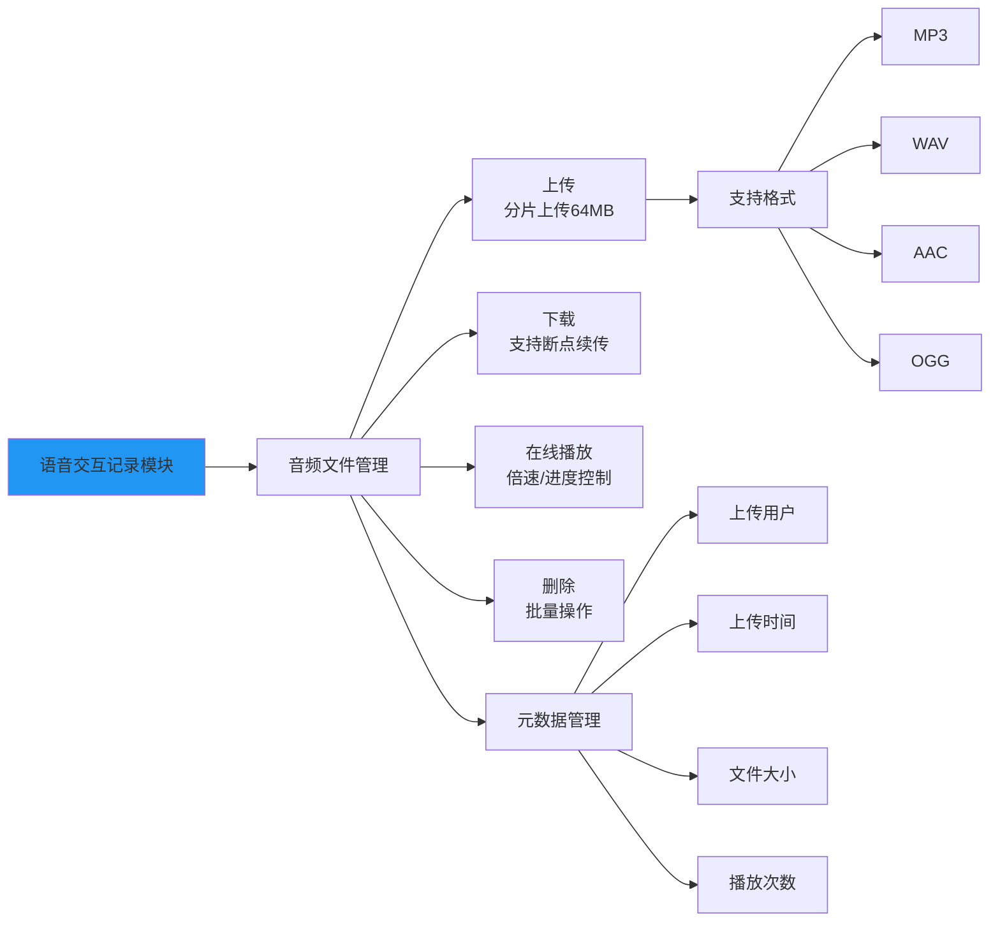

### 3️⃣ 远程桌面控制模块

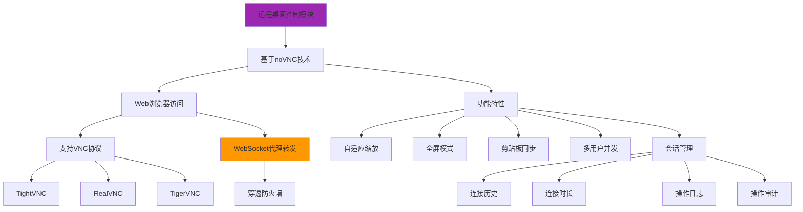

### 4️⃣ 视频监控模块

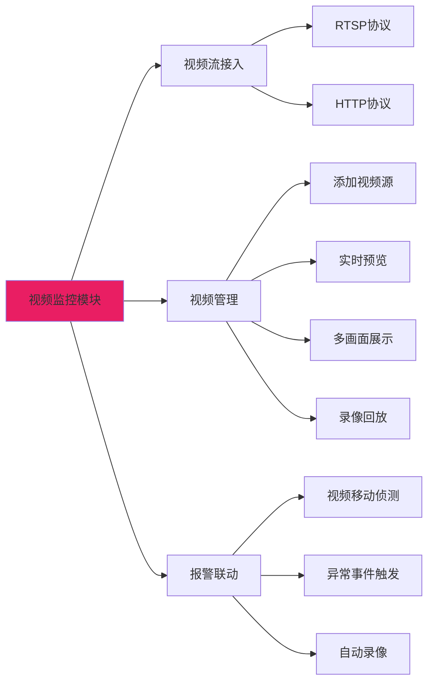

### 5️⃣ 硬件状态检测模块

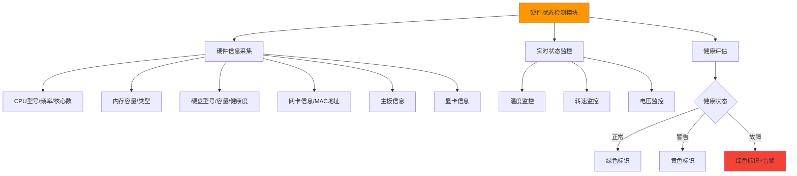

### 6️⃣ 软件更新管理模块

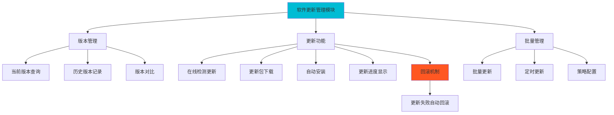

### 7️⃣ 数据同步状态模块

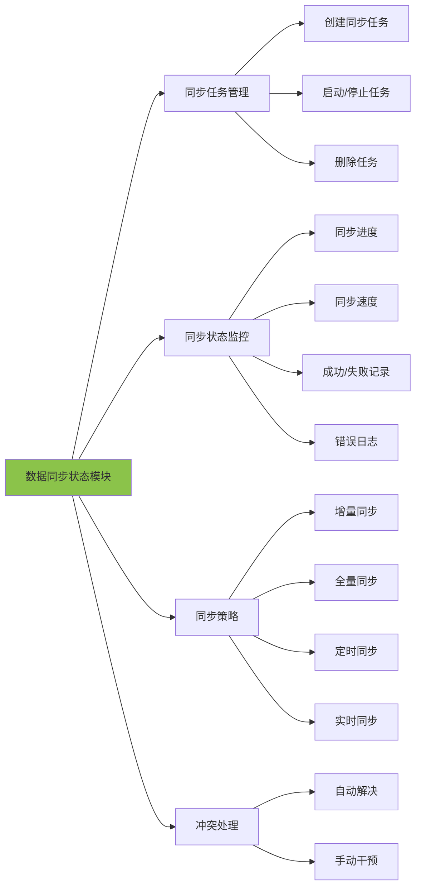

### 8️⃣ 异常报警模块

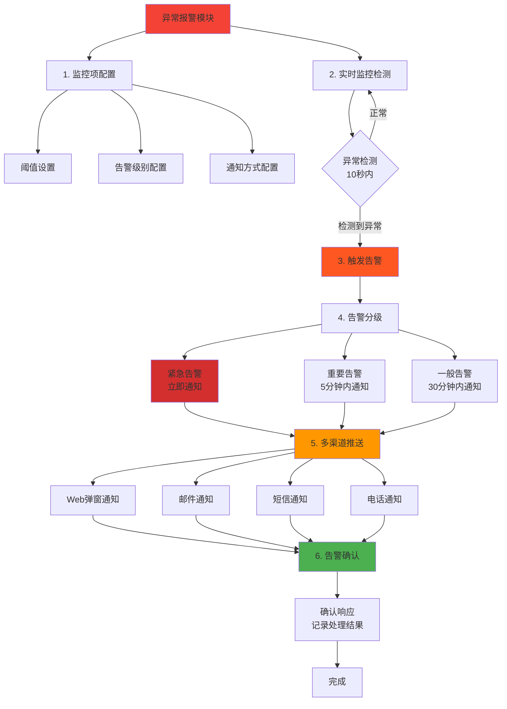

### 9️⃣ 性能分析报告模块

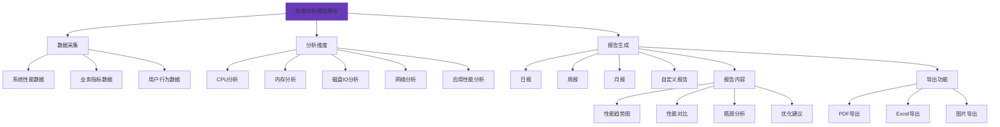

### 🔟 维护操作日志模块

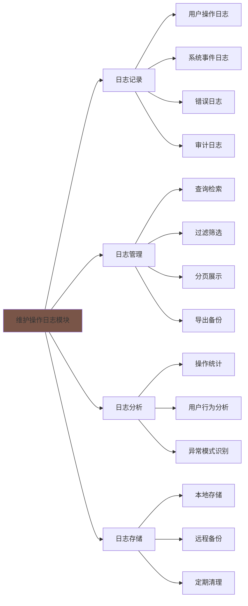

---

## 🛠️ 技术栈架构

```mermaid
flowchart TD
    A["🎨 前端技术栈"] --> A1["HTML5 + CSS3 + JavaScript"]
    A --> A2["响应式设计 Responsive Design"]
    A --> A3["ECharts 图表可视化"]
    A --> A4["noVNC 远程桌面"]
    A --> A5["WebSocket 实时通信"]
  
    B["⚙️ 后端技术栈"] --> B1["Go 1.20+ 编程语言"]
    B --> B2["Gin Web 框架"]
    B --> B3["goroutine 轻量级协程"]
    B --> B4["channel 通道通信"]
    B --> B5["gopsutil 系统监控库"]
  
    C["💾 数据存储层"] --> C1["SQLite 嵌入式数据库"]
    C --> C2["Redis 缓存系统"]
    C --> C3["索引优化技术"]
    C --> C4["自动备份机制"]
  
    D["🔗 通信协议"] --> D1["RESTful API 规范"]
    D --> D2["WebSocket 长连接"]
    D --> D3["VNC 远程控制协议"]
    D --> D4["RTSP/HTTP 流媒体"]
  
    E["🔐 安全机制"] --> E1["bcrypt 密码加密"]
    E --> E2["JWT Token 认证"]
    E --> E3["TLS 1.3 加密传输"]
    E --> E4["RBAC 权限控制"]
    E --> E5["防SQL注入/XSS/CSRF攻击"]
  
    style A fill:#E3F2FD
    style B fill:#FFF3E0
    style C fill:#F3E5F5
    style D fill:#E8F5E9
    style E fill:#FFEBEE
```

---

## 📊 系统性能指标

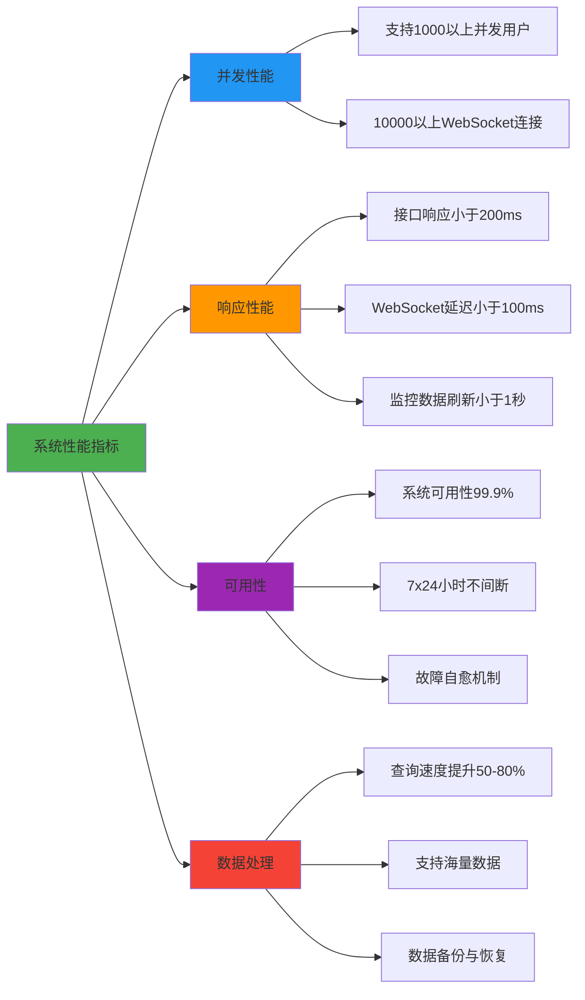

---

## 🚀 项目实施流程

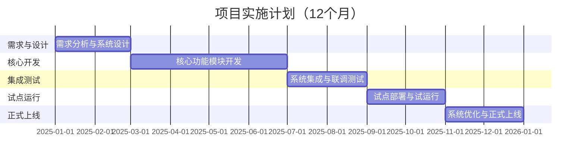

---

## 🎯 用户使用流程

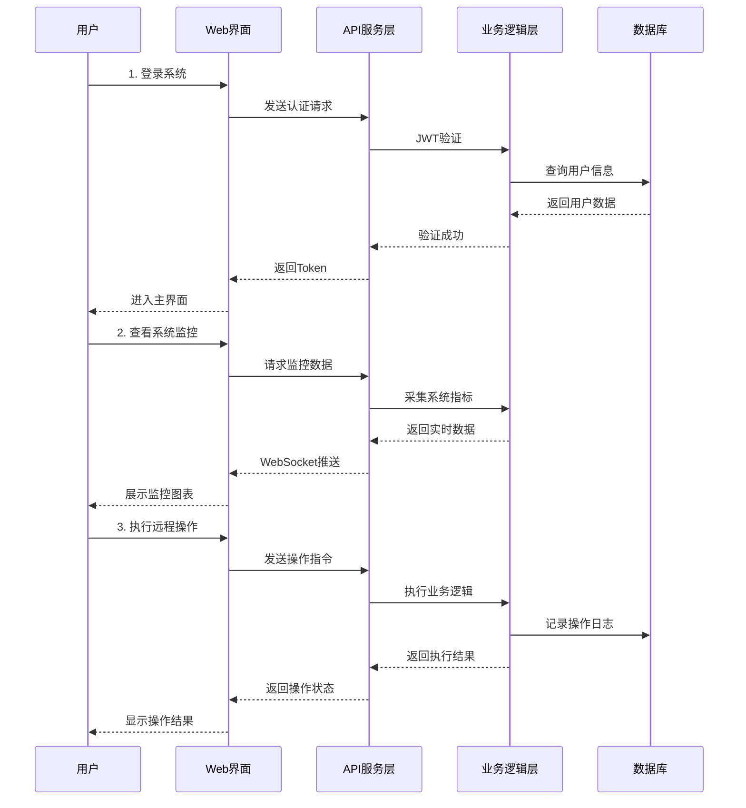

---

## 📈 系统优势与创新点

### 核心优势

1. **高并发架构** - 基于Go语言goroutine，单机支持万级并发
2. **实时通信优化** - WebSocket长连接，消息延迟≤100ms
3. **多层安全防护** - TLS加密 + JWT认证 + RBAC权限
4. **智能告警系统** - 10秒内检测异常并推送多渠道告警
5. **模块化设计** - 10大独立模块，灵活扩展
6. **跨平台部署** - 支持Windows/Linux/macOS，Docker容器化

### 技术创新

- ✅ 基于CSP并发模型的高效goroutine池技术
- ✅ WebSocket智能断线重连与消息队列缓冲
- ✅ 多层安全防护体系（网络层+应用层）
- ✅ 数据库索引优化，查询性能提升50-80%
- ✅ 基于noVNC的Web远程桌面控制
- ✅ 智能告警算法与多级告警机制

---

## 📝 总结

本项目构建了一套**功能完善、技术先进、安全可靠**的企业级智能设备管理系统：

- **10大核心功能模块** - 覆盖设备管理全生命周期
- **4层技术架构** - 展示层/API层/业务层/数据层清晰分离
- **5大安全机制** - 全方位保障系统安全
- **约20,000行源代码** - 高质量、可维护的代码实现
- **99.9%系统可用性** - 7×24小时不间断服务

通过采用Go语言、WebSocket、noVNC等先进技术，项目目标是为企业提供高效、智能、安全的设备管控解决方案，助力企业数字化转型。
